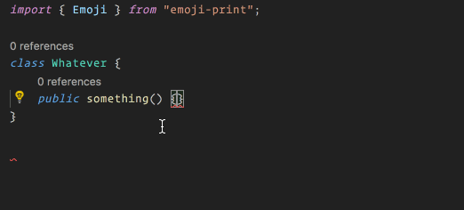
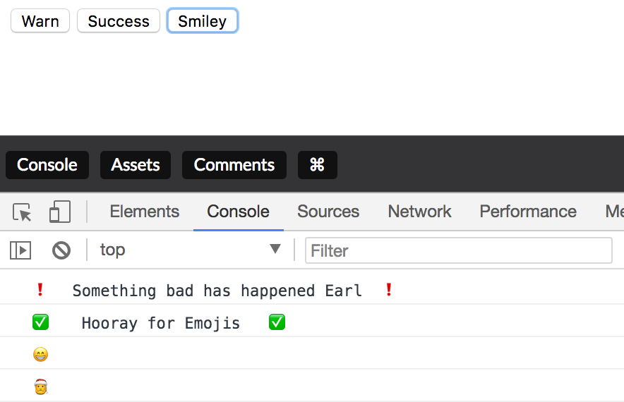

<p align="center">
 <h3 align="center">
  Emoji-Print 
  </h3>
  <p align="center">
  :heart_eyes: :wink: :sunglasses: :poop: :facepunch: :turtle: :cake: :pizza:
  </p>
  A simple utility to console log with emojis.
</p>

[](https://www.npmjs.com/package/emoji-print)
[](https://www.npmjs.com/package/emoji-print)
[](https://www.paypal.me/bradwayne88)

_Not all emojis are going to log correctly._

### Screenshot

| Sample TypeScript with Intellisense   |              Sample Logs              |
| ------------------------------------- | :-----------------------------------: |
|  |  |

## CodePen Demo

[CodePen Demo](https://codepen.io/bradwaynemartin/pen/QmmXKb) - open the console and tap the buttons to see the emoji in the console logs.

### Installation

`npm install emoji-print --save`

### Usage (Several Options)

<h4> TypeScript </h4>

```typescript
import { Emoji, EmojiSuccess } from 'emoji-print';

public someEvent() {
    console.log(Emoji.Food.eggplant);
}

public anotherEvent() {
  // EmojiSuccess is a utility to console.log with leading/trailing check marks.
  EmojiSuccess("something great happened");
}
```

<h4> Using modules with javascript </h4>

```javascript
const EmojiPrint = require("emoji-print");

function something() {
  console.log(EmojiPrint.Emoji.Smiley.hugging_face);
}

function anyEvent() {
  // EmojiWarn is a utility to console.log with leading/trailing exclamations.
  EmojiPrint.EmojiWarn("some error happened, abort mission");
}

function anotherEvent() {
  // EmojiSuccess is a utility to console.log with leading/trailing check marks.
  EmojiPrint.EmojiSuccess("something great happened");
}
```

<h4> Loading Emoji-Print as a library with a script tag </h4>

This will expose a variable `emojiPrint` for the library, made possible through bundling with [webpack](https://webpack.js.org/).

```html
<button onclick="doSomething()"></button>

<script src="https://unpkg.com/emoji-print@0.2.0/dist/emoji-print.js"></script>
<script>
  function doSomething() {
    console.log(emojiPrint.Emoji.Food.tomato);
    // or call the utility log functions for emoji-print
    emojiPrint.EmojiWarn('Oh No, this is really bad.');
  }
</script>
```
